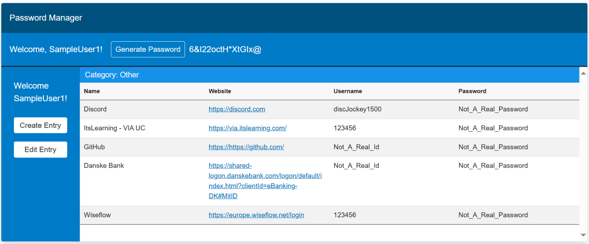
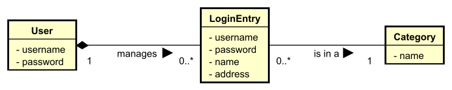

# Password Manager

## Features
Developed in Java and C#, using Blazor, .Net Core, PostgreSQL, Spring Boot, Spring Security (Argon2), Maven, gRPC, Restful webservices (principle), AES Encryption, HTTPS/SSL, JPA implemented with Hibernate and various design patterns, such as: Factory, Command, Observer & Adapter patterns.

Features include:
1. Login and User creation functionality (encrypted).
2. User Login Credential storage and management.
3. Scalable solution, where backend servers can be initialized and decomissioned independently as needed to handle peaks in usage. Uses Load Balancing extensively.
4. Persistence - using Object Relational Modelling with JPA, implemented with Hibernate.
5. Secure communication from Web Interface (HTTPS/SSL) to first Java load balancer.
6. Implementation of GRPC communication protocols for the Java backend.
7. Implementation of secure hashing (Argon2) for user credential storage.

## Video Showcase
https://github.com/user-attachments/assets/8fe13462-ce9a-4931-a713-08d11ce2e21b

## Installation and Usage:
Please follow the instructions presented in the [Installation Manual](Development_Files/Installationsguide%20for%20PasswordManager.pdf) and the [User Guide](Development_Files/Reference%20Manual.pdf)

## UML Use Case Diagram

## UML Domain Model

## Global Relations Diagram

## Container Diagram
.svg)

## UML Class Diagram

